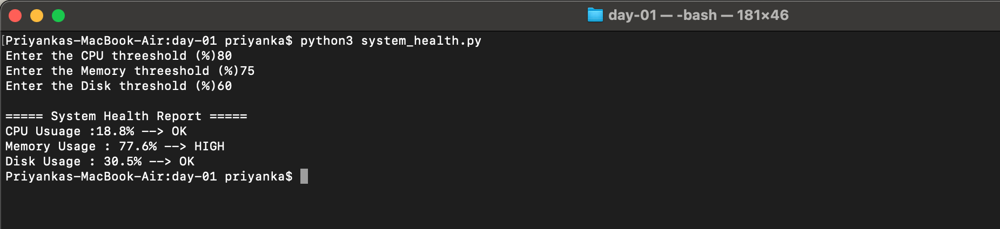

# Day 01 – Introduction to Python for DevOps

## Task

- Takes CPU, Disk, and Memory threshold values from the user
- Fetches real-time system metrics using `psutil`
- Compares actual values with thresholds
- Prints status as **OK or HIGH**

---

## Implementation

I implemented the solution using:
- `input()` to take threshold values from user
- `psutil` library to fetch system metrics
- `dictionaries` to store metrics and thresholds
- `for` loop to iterate through values
- `if/else` conditions to compare values and generate status
- `functions` to keep code clean and reusable

---

## Script

[Script](./system_health.py)

---
## Output:

