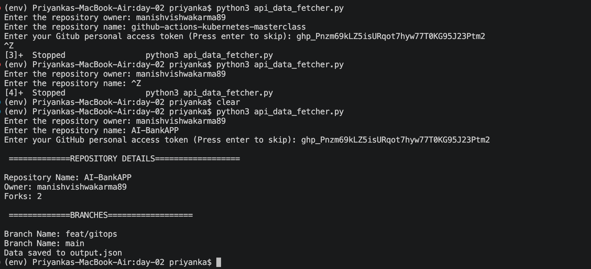

# Day 02 – Automating System Tasks with Python

## Task

- Calls a public API (GitHub API)
- Fetches data using `requests` library
- Parses JSON response
- Extracts workflow details (ID, Name, Path, State, Updated Time)
- Prints processed output to terminal
- Saves processed data into a JSON file

---

## Implementation

I implemented the solution using:

- `requests` library to call GitHub API
- `.json()` method to parse API responses
- `dictionaries` and `lists` to structure data
- `for` loop to iterate through workflows
- `functions` to keep code clean and reusable
- `json` module to save output into a file

---

## Script

[Script](./api_data_fetcher.py)

---

## Output:

### Terminal Output

### JSON Output
